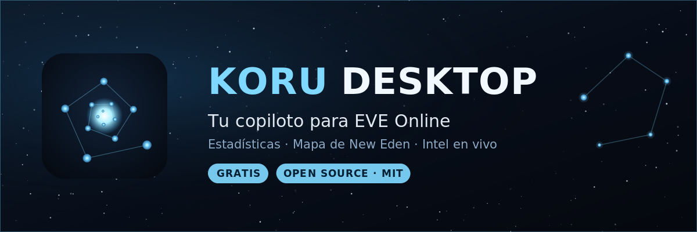
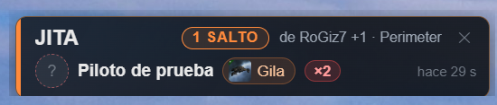
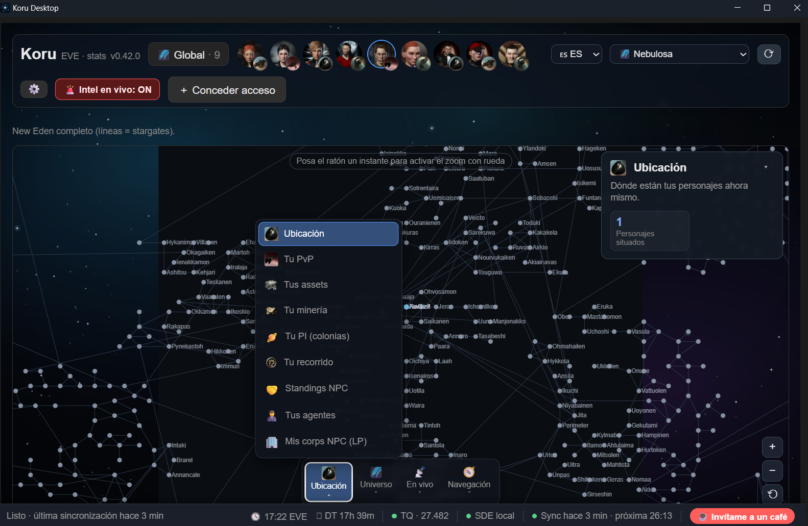
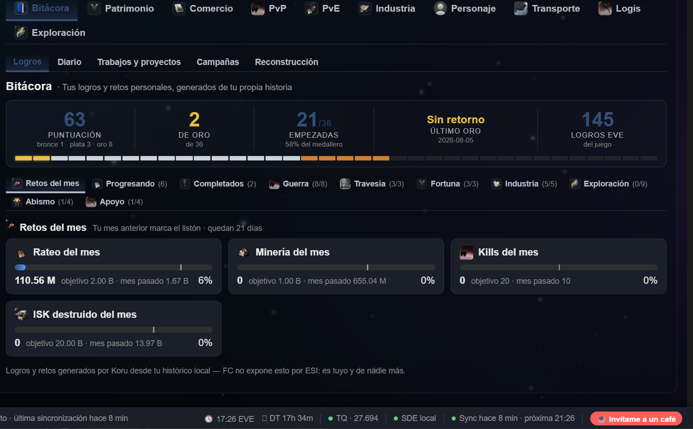
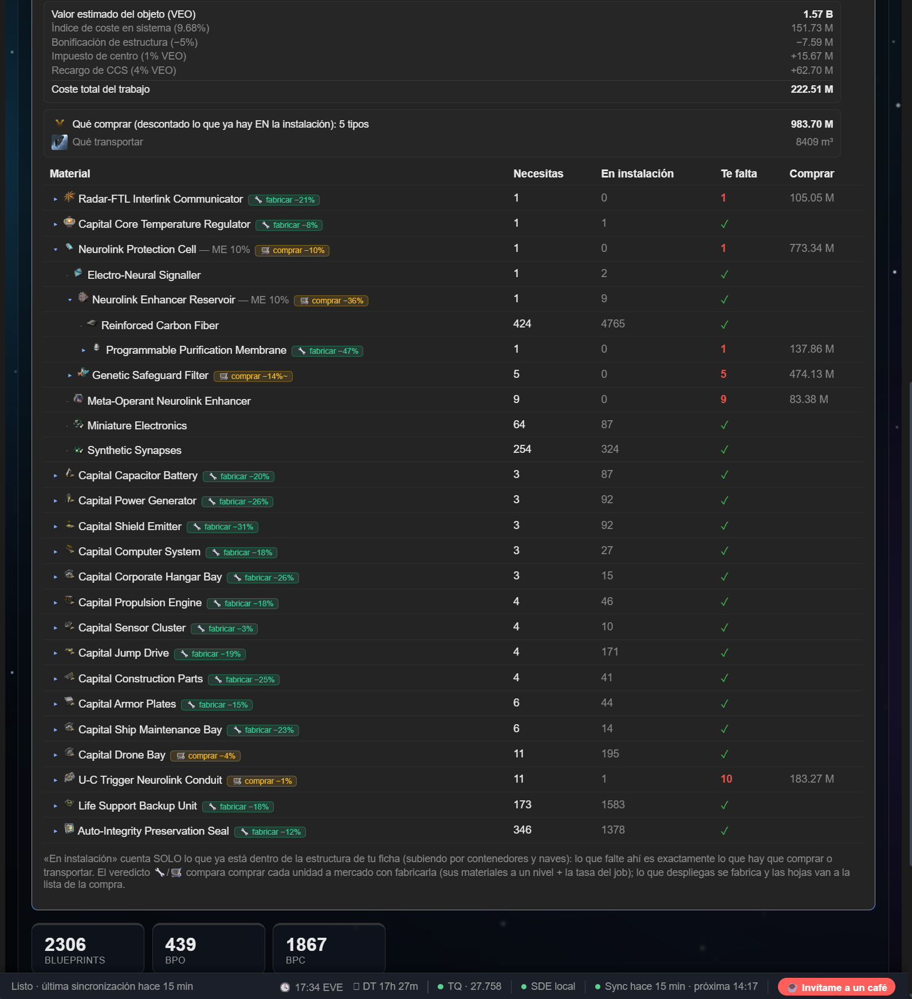
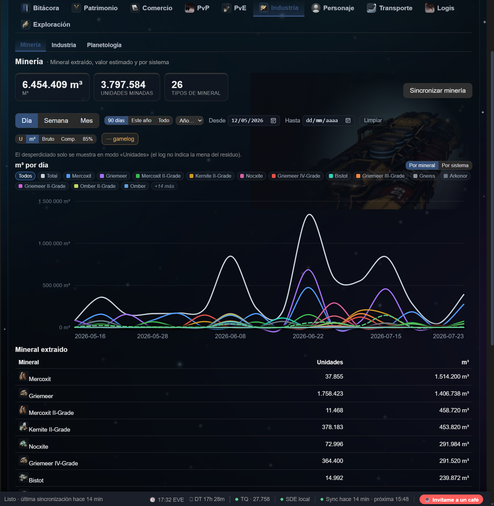

<p align="center">
  
</p>

<p align="center">
  <a href="README.md">🇬🇧 English</a> · <b>🇪🇸 Español</b>
</p>

<p align="center">
  App de escritorio <b>local-first</b> y <b>open source</b> para <b>EVE Online</b>: tus estadísticas,
  tu historia y un <b>mapa de New Eden con intel en vivo</b>, hablando directamente con la API oficial (ESI).
</p>

<p align="center">
  <a href="https://github.com/RoGiz7/koru-desktop/releases/latest"><b>⬇️ Descargar última versión</b></a> ·
  <a href="https://github.com/RoGiz7/koru-desktop/releases">Todas las releases</a> ·
  <a href="https://ko-fi.com/rogiz7">☕ Invítame a un café</a>
</p>

<p align="center">
  <a href="https://github.com/RoGiz7/koru-desktop/releases/latest"></a>
  
  
  
  
</p>

---

Hecha con cariño para la comunidad: **gratis, sin ánimo de lucro y sin competir con nadie.**

Koru funciona en **Windows y Linux**, y toda la interfaz está en **español e inglés** — se cambia desde
la barra superior, sin reiniciar.

## 🎯 Qué la hace distinta

Casi todas las herramientas de EVE te enseñan **una foto**: lo que ESI devuelve ahora mismo. Y ESI
olvida: los trabajos de industria desaparecen a los 90 días, los contratos a los 30, y tus assets no
tienen histórico ninguno.

**Koru guarda la película.** Almacena tus datos en local, día tras día, para poder contestar lo que ESI
no puede: qué estabas fabricando hace tres meses, cómo se movió de verdad tu patrimonio, o qué sistemas
de tu ruta se encienden y a qué hora de la noche.

Eso último es la clave. Koru lleva meses grabando **tu propio intel**, así que puede decirte cosas que
ningún killboard sabe, porque salen de datos que solo tienes tú.

Y desde la v0.46, «la película» es literal: **graba una op de flota y reprodúcela sobre el mapa** —
tu flota moviéndose por New Eden como se movió aquella noche, con los avisos de intel pulsando a su
hora. Nadie había podido volver a ver su flota moverse. Ahora sí.

<p align="center">
  
</p>
<p align="center">
  <sub><i>El aviso flotante, encima del juego. No solo <b>«1 salto»</b> — <b>de quién</b> es ese salto, en <b>qué nave</b><br>
  y hace cuánto. La línea de intel, ya leída por ti.</i></sub>
</p>

## ⬇️ Descargar

Coge el instalador de la **[última release](https://github.com/RoGiz7/koru-desktop/releases/latest)**.

### Windows

Descarga el `.msi` o el `setup.exe` y ejecútalo. Una vez instalada **se actualiza sola**: cuando publico
una versión nueva, la app te avisa y se actualiza al reiniciar.

> **Aviso de SmartScreen:** la app aún no está firmada con certificado, así que Windows mostrará
> *"Windows protegió tu PC"*. Pulsa **Más información → Ejecutar de todas formas**. Es normal en apps
> indie y el aviso se suaviza según más gente la descarga.

### Linux

Se publican tres formatos — coge el que le encaje a tu distro:

| Formato | Instalación | Se actualiza sola |
|---|---|---|
| **`.AppImage`** | `chmod +x` y a correr | ✅ **sí** |
| **`.deb`** | Debian, Ubuntu, Mint… | ❌ a mano |
| **`.rpm`** | Fedora, openSUSE… | ❌ a mano |

> ⚠️ **En Linux el updater solo funciona con el AppImage.** El `.deb` y el `.rpm` se instalan bien y
> funcionan igual, pero no pueden reemplazarse a sí mismos: con esos, la versión nueva se descarga a
> mano. Si quieres que la app se mantenga al día sola, coge el AppImage.

Probada en X11 y compilada sobre Ubuntu 22.04 a propósito, para que el AppImage no arrastre una glibc
más nueva que la de la mayoría de distros.

## ✨ Qué tiene

- 🚨 **Intel en vivo + el aviso flotante** — lee tus canales de intel del log de chat del juego
  (**solo lectura, seguro para los TOS**) y pinta los hostiles en el mapa en tiempo real. Alertas de
  **proximidad** desde tu personaje **y desde puntos de ancla** (staging, chokepoints…), con
  **notificación nativa aunque la app esté minimizada**, sonido configurable, enlace del hostil a
  **zKillboard** y su trayectoria según los reportes.
  El **aviso flotante se pone encima del juego** y contesta lo que la alarma sola no dice: no solo
  *«5 saltos»*, sino **de quién** son esos 5 saltos. También puedes **silenciar un sistema** cuando un
  canal se pone pesado — se calla la alarma, nunca el dato, y el mapa te enseña que está silenciado.
- 🗺️ **Mapa de New Eden** con capas conmutables agrupadas por categorías: tu ubicación y tu recorrido,
  lugares/POI, seguridad, soberanía, guerra de facciones, incursiones, kills y jumps de la última hora,
  **wormholes Thera/Turnur** (vía eve-scout) y tus capas personales (PvP, assets, minería).
- 🛰 **Flotas** — **graba la op que mandas** (solo el comandante puede; un sondeo cada 30 segundos)
  con la **composición en vivo** por alas y escuadras, tu flota **en verde sobre el mapa**, y el visor
  para releerla después: la **película** de la op (entradas, saltos, reships, kills, pérdidas y cantos
  de intel intercalados a su hora), la **cinta de presencia**, el balance de tus pilotos golpe a golpe
  y el cara a cara con cada rival. Y el broche: el **reproductor sobre el mapa**, con play, pausa,
  velocidad y la barra de tiempo marcada — porque los killmails no cuentan una flota, y un logi que
  se pasa la noche reparando jamás aparece en ellos.
- 💬 **Social** — tus **conversaciones privadas, por fin legibles**: EVE ya las escribe en disco, pero
  partidas en cientos de ficheros de sesión que el cliente no vuelve a enseñarte. Koru las cose en
  años de historial agrupado por interlocutor, en estilo chat, con retratos y colores estables.
  Solo lee lo que el juego ya escribió — solo lectura a propósito, y nada sale de tu ordenador.
- 🧭 **Navegación** — planificador de **rutas** (stargates, con tu red de Ansiblex declarada) y de
  **saltos de capital** con rango, combustible y fatiga calculados según tu nave y tus skills. Cualquier
  ruta se manda al juego de un clic.
- ⚔️ **PvP** — killmails (ESI + zKillboard), eficacia ISK, top de naves y sistemas, rivales, batallas,
  actividad por día y hora, y una vista de **cazador**.
- 🏭 **Industria** — el pilar entero: **fabricación, invención, copia y reacciones**, con el coste real de
  un trabajo (rigs, índice de coste del sistema, multiplicador de seguridad, impuestos de la instalación)
  y **fabricar-o-comprar**. Lista de materiales con volúmenes, biblioteca de planos y contribución a
  campañas militares.
- 🚚 **Transporte** — **qué tienes y dónde**, separando carga de flota montada, con la **capacidad de
  carga real de tus naves** (incluidas las bodegas especializadas: mineral, flota, planetaria) y un
  **libro de contratos de courier** que empieza a grabar desde el primer día.
- 📖 **Bitácora y medallas** — tu historia mes a mes: 36 medallas con su propia serie, hitos con fecha,
  diario por años y runs abisales/CRAB multicuenta.
- 📡 **Exploración** — rastreador de firmas con histórico local.
- 💰 **Patrimonio y finanzas** — valor de tus assets con precios públicos de mercado, con **snapshots
  locales y gráfico de evolución**, wallet, rateo con histórico, minería, comercio (órdenes) y
  planetología (PI).
- 🚀 **Assets y fiteos** — assets con ubicación y contenedor, con *drill-down*; **gestor de fiteos**
  (importa desde EFT o desde el propio juego) con visor circular y **chequeo de skills**.
- 🧑‍🚀 **Personaje** — ficha completa (atributos, implantes, clones), skills y colas. Todo **por personaje**
  y en **vista global** multi-cuenta.
- 💾 **Copias de seguridad** — backup y restauración de tu histórico local, con copias automáticas.

## 📸 Capturas

<table>
  <tr>
    <td width="50%"><br><sub><b>El mapa</b> — tus propias capas (PvP, assets, minería, tu recorrido) sobre los datos en vivo del cluster. Todas conmutables.</sub></td>
    <td width="50%"><br><sub><b>Bitácora</b> — 36 medallas con su propia serie mensual, construidas con tu histórico local. Esto ESI no lo guarda; Koru sí.</sub></td>
  </tr>
  <tr>
    <td width="50%"><br><sub><b>Industria</b> — lo que <i>de verdad</i> cuesta un trabajo: rigs, índice de coste del sistema, multiplicador de seguridad e impuestos — y lo que ya tienes.</sub></td>
    <td width="50%"><br><sub><b>Minería</b> — todo el mineral que has sacado, con su volumen y su valor, con meses de histórico local detrás.</sub></td>
  </tr>
</table>

Más en la **[galería de Ko-fi](https://ko-fi.com/album/Koru--Descktop-Y1T622A8LH)**.

## 🔒 Privacidad

Todo es **local y privado**. La app habla solo con ESI y zKillboard usando **tus** propios tokens:

- Autenticación **OAuth2 PKCE** (sin client secret).
- Los *refresh tokens* se guardan en el **keychain del sistema operativo**, nunca en disco plano ni en
  este repositorio.
- **No hay servidor propio ni telemetría**: tus datos no salen de tu máquina salvo las llamadas a
  ESI/zKill.
- Solo se piden los **scopes** de cada sección, de forma granular.

Al ser open source, puedes verificar tú mismo todo lo anterior antes de iniciar sesión.

## 🛠️ Compilar desde el código

Requisitos: [Node.js](https://nodejs.org/) y [Rust](https://www.rust-lang.org/tools/install) +
[prerrequisitos de Tauri](https://v2.tauri.app/start/prerequisites/).

```bash
npm install
npm run tauri dev     # desarrollo
npm run tauri build   # genera el instalador en src-tauri/target/release/bundle/
```

En **Debian/Ubuntu** hacen falta además las librerías del sistema:

```bash
sudo apt-get install -y libwebkit2gtk-4.1-dev librsvg2-dev patchelf \
  build-essential curl wget file libxdo-dev libssl-dev libayatana-appindicator3-dev
```

> ⚠️ Instala `libayatana-appindicator3-dev`, **no** el viejo `libappindicator3-dev` — entran en
> conflicto, y poner los dos hace que apt aborte.

Para usar tu propia aplicación registrada, pon tu `client_id` en `src-tauri/src/config.rs`
(ver [`docs/REGISTRO_APP.md`](docs/REGISTRO_APP.md)). En PKCE el `client_id` no es secreto.

## ☕ Apoyar el proyecto

Si te resulta útil y quieres invitar a un café, se agradece — pero **es del todo voluntario**: la app es
y será igual de completa para todo el mundo, dones o no.

**[ko-fi.com/rogiz7](https://ko-fi.com/rogiz7)**

## 🙌 Créditos y agradecimientos

- **Fenris Creations** (antes CCP Games) por EVE Online, la API ESI y el Static Data Export.
- La **comunidad de desarrolladores de EVE**, de la que esta herramienta aprende y a la que quiere
  devolver algo. Inspiración, solo inspiración: sin copiar código.
- Construida con **Tauri**, **Rust** y **React**.

## 🤝 Transparencia de desarrollo

Koru se desarrolla **con asistencia de IA** (Claude, de Anthropic) como herramienta de
programación — igual que otros proyectos usan un compilador o un IDE. Cada línea se revisa, se
prueba contra datos reales y la aprueba un humano antes de publicarse. **La aplicación en sí no
contiene IA**: lee tus registros locales del juego y la API oficial ESI, de forma determinista, y
nada sale nunca de tu ordenador. Esta nota existe por lo mismo que el resto de este README:
mereces saber exactamente qué estás ejecutando — hoy, y cuando las reglas del mañana cambien.

## 📄 Licencia

[MIT](LICENSE). Úsala, modifícala y compártela libremente.

---

EVE Online y el logo de EVE son marcas registradas de Fenris Creations (anteriormente CCP Games / CCP hf.).
Esta es una herramienta de **terceros**, **no afiliada ni respaldada por Fenris Creations**. Todo el
material relacionado con EVE Online es propiedad de sus respectivos titulares.
