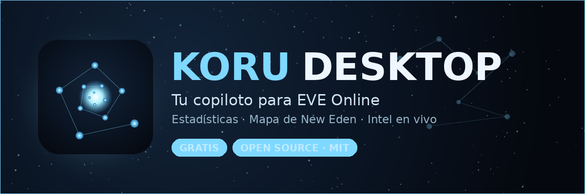

<p align="center">
  
</p>

<p align="center">
  App de escritorio <b>local-first</b> y <b>open source</b> para <b>EVE Online</b>: tus estadísticas
  y un <b>mapa de New Eden con intel en vivo</b>, hablando directamente con la API oficial (ESI).
</p>

<p align="center">
  <a href="https://github.com/RoGiz7/koru-desktop/releases/latest"><b>⬇️ Descargar última versión</b></a> ·
  <a href="https://github.com/RoGiz7/koru-desktop/releases">Todas las releases</a> ·
  <a href="https://ko-fi.com/rogiz7">☕ Apoyar</a>
</p>

<p align="center">
  <a href="https://github.com/RoGiz7/koru-desktop/releases/latest"></a>
  
  
  
</p>

---

Hecha con cariño para la comunidad: **gratis, sin ánimo de lucro y sin competir con nadie**. El mapa es
el corazón — tus datos (PvP, assets, minería, ubicación) y los datos públicos del cluster (soberanía,
guerra de facciones, incursiones, wormholes…) se superponen como capas sobre el New Eden real.

## ⬇️ Descargar

Coge el instalador de la **[última release](https://github.com/RoGiz7/koru-desktop/releases/latest)**
(`.msi` o `setup.exe`) y ejecútalo. Una vez instalada, **se actualiza sola**: cuando publico una versión
nueva, la app te avisa y se actualiza al reiniciar.

> **Aviso de SmartScreen:** la app aún no está firmada con certificado, así que Windows mostrará
> "Windows protegió tu PC". Pulsa **Más información → Ejecutar de todas formas**. Es normal en apps indie
> y el aviso se suaviza según más gente la descarga.

## ✨ Qué tiene

- 🚨 **Intel en vivo (lo más nuevo)** — lee tus canales de intel del log de chat del juego (solo lectura,
  seguro para los TOS) y **pinta los hostiles en el mapa en tiempo real**. Alertas de **proximidad** desde
  tu personaje **y puntos de ancla** (staging, chokepoints…), con **notificación nativa aunque la app esté
  minimizada** (detección en un hilo en segundo plano, no se ralentiza), **sonido configurable** (varios
  presets o tu propio archivo), enlace del hostil a **zKillboard** y su **trayectoria** según los reportes.
- 🗺️ **Mapa de New Eden** con capas conmutables agrupadas por categorías: Ubicación, Lugares/POI, Seguridad,
  Soberanía, Guerra de facciones, Incursiones, Kills/Jumps de la última hora, **wormholes Thera/Turnur**
  (vía eve-scout) y tus capas personales (PvP, assets, minería).
- 🧭 **Navegación** — planificador de **rutas** (stargates) y de **saltos** de capital con **rango,
  combustible y fatiga** calculados según tu nave y tus skills.
- ⚔️ **PvP** — killmails (ESI + zKillboard), eficacia ISK, top de naves y sistemas, rivales, batallas y
  actividad por día/hora.
- 💰 **Patrimonio y finanzas** — valor de tus assets (precios públicos de mercado) con **snapshots locales
  y gráfico de evolución**, wallet, **rateo** con histórico local, minería, comercio (órdenes) y
  planetología (PI).
- 🚀 **Assets y Fiteos** — assets con ubicación/contenedor y *drill-down*; **gestor de fiteos** (importa
  desde EFT o desde el propio juego) con **visor circular** y **chequeo de skills** del personaje.
- 🧑‍🚀 **Personaje** — ficha completa (atributos, implantes, clones), skills y colas. Todo **por personaje**
  y en **vista global** multi-cuenta.
- 💾 **Copias de seguridad** — backup y restauración de tu histórico local, con copias automáticas.

## 🔒 Privacidad

Todo es **local y privado**. La app habla solo con ESI y zKillboard usando **tus** propios tokens:

- Autenticación **OAuth2 PKCE** (sin client secret).
- Los *refresh tokens* se guardan en el **keychain del sistema operativo**, nunca en disco plano ni en el
  repositorio.
- **No hay servidor propio ni telemetría**: tus datos no salen de tu máquina salvo las llamadas a ESI/zKill.
- Solo se piden los **scopes** de cada sección, de forma granular.

Al ser **open source**, puedes verificar tú mismo todo lo anterior antes de iniciar sesión.

## 🛠️ Compilar desde el código

Requisitos: [Node.js](https://nodejs.org/) y [Rust](https://www.rust-lang.org/tools/install) +
[prerrequisitos de Tauri](https://v2.tauri.app/start/prerequisites/).

```bash
npm install
npm run tauri dev     # desarrollo
npm run tauri build   # genera el instalador en src-tauri/target/release/bundle/
```

Para usar tu propia app registrada en CCP, pon tu `client_id` en `src-tauri/src/config.rs`
(ver `docs/REGISTRO_APP.md`). En PKCE el `client_id` no es secreto.

## ☕ Apoyar el proyecto

Si te resulta útil y quieres invitar a un café, se agradece — pero **es del todo voluntario**: la app es y
será igual de completa para todo el mundo, dones o no.

**[ko-fi.com/rogiz7](https://ko-fi.com/rogiz7)**

## 🙌 Créditos y agradecimientos

- **Fenris Creations** (antes CCP Games) por EVE Online, la API ESI y el Static Data Export.
- La **comunidad de desarrolladores de EVE**, de la que esta herramienta aprende y a la que quiere devolver
  algo. Inspiración (solo inspiración, sin copiar código) en herramientas de la comunidad.
- Construida con **Tauri**, **Rust** y **React**.

## 📄 Licencia

[MIT](LICENSE). Úsala, modifícala y compártela libremente.

---

EVE Online y el logo de EVE son marcas registradas de Fenris Creations (anteriormente CCP Games / CCP hf.).
Esta es una herramienta de **terceros**, **no afiliada ni respaldada por Fenris Creations**. Todo el
material relacionado con EVE Online es propiedad de sus respectivos titulares.
