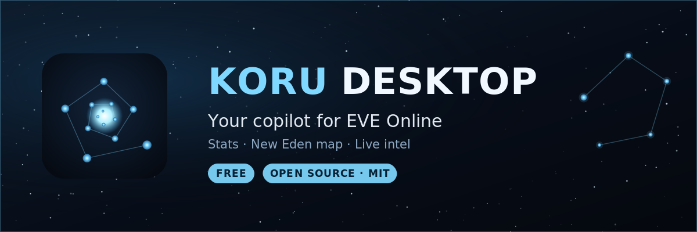
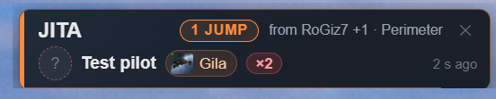
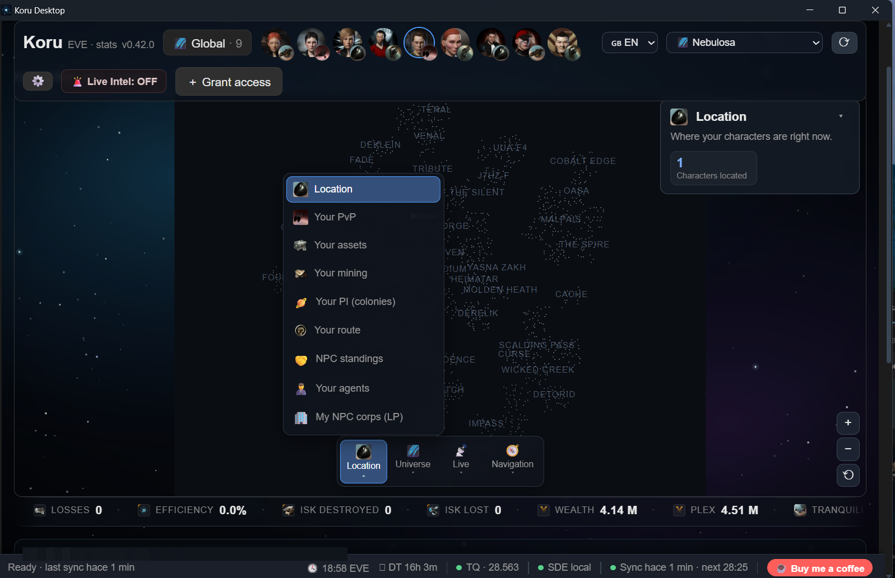
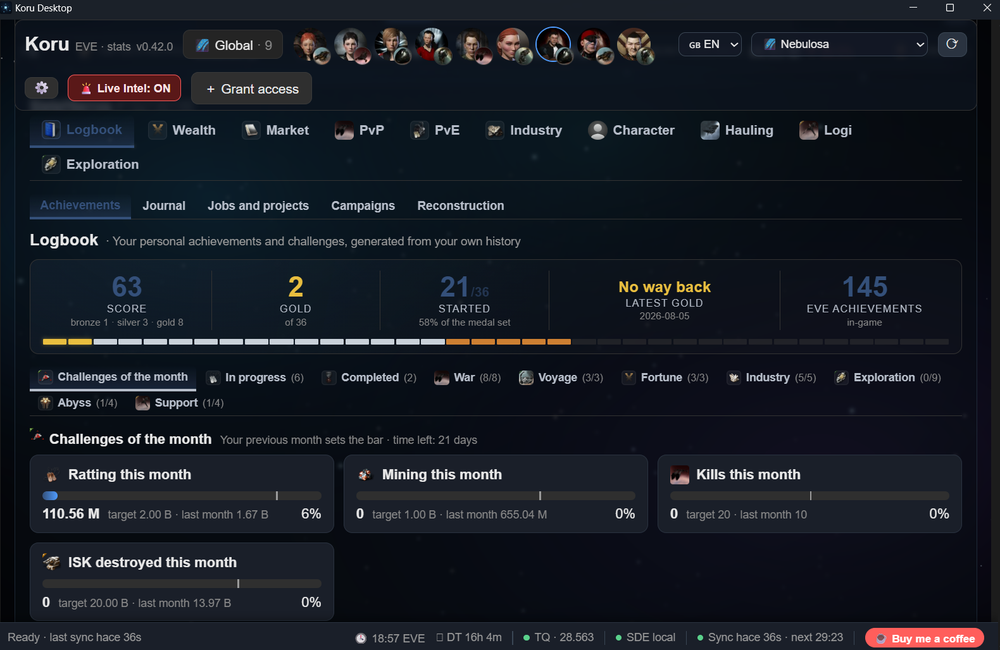
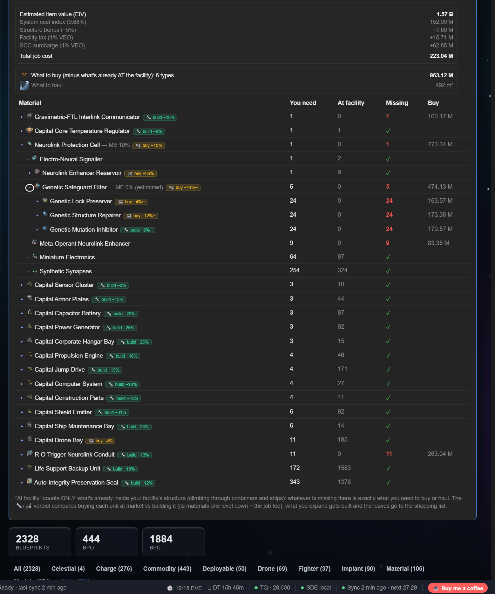
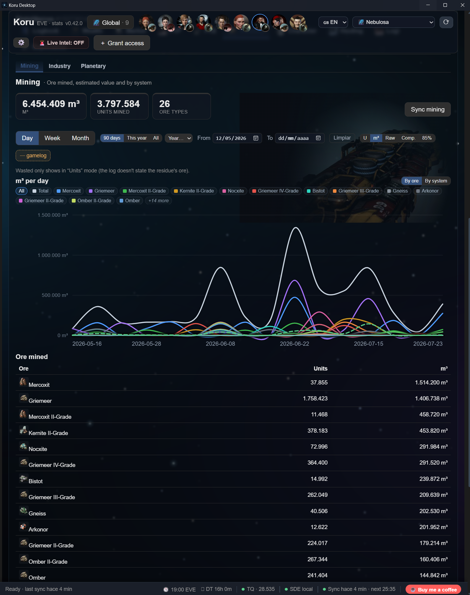

<p align="center">
  
</p>

<p align="center">
  <b>🇬🇧 English</b> · <a href="README.es.md">🇪🇸 Español</a>
</p>

<p align="center">
  A <b>local-first</b>, <b>open source</b> desktop app for <b>EVE Online</b>: your stats, your history,
  and a <b>New Eden map with live intel</b> — talking straight to the official API (ESI).
</p>

<p align="center">
  <a href="https://github.com/RoGiz7/koru-desktop/releases/latest"><b>⬇️ Download latest</b></a> ·
  <a href="https://github.com/RoGiz7/koru-desktop/releases">All releases</a> ·
  <a href="https://ko-fi.com/rogiz7">☕ Buy me a coffee</a>
</p>

<p align="center">
  <a href="https://github.com/RoGiz7/koru-desktop/releases/latest"></a>
  
  
  
  
</p>

---

Built for the community: **free, non-commercial, and not trying to compete with anyone.**

Koru runs on **Windows and Linux**, and the whole interface is available in **English and Spanish** —
switch language from the top bar, no restart needed.

## 🎯 What makes it different

Most EVE tools show you **a snapshot**: what ESI returns right now. ESI forgets — industry jobs vanish
after 90 days, contracts after 30, and your assets have no history at all.

**Koru keeps the film.** It stores your data locally, day after day, so it can answer questions ESI
simply cannot: what you were building three months ago, how your wealth actually moved, which systems
light up on your route and at what time of night.

That last one is the point. Koru has been recording **your own intel** for months — so it can tell you
things no killboard can, because they're built from data only you have.

And since v0.46, "the movie" is literal: **record a fleet op and replay it on the map** — your fleet
moving across New Eden the way it did that night, with intel calls pulsing at their exact time.
Your op, on the map, exactly as it happened.

<p align="center">
  
</p>
<p align="center">
  <sub><i>The overlay, floating over the game. Not just <b>"1 jump"</b> — <b>whose</b> jump, in <b>what ship</b>,<br>
  and how long ago. The intel line, already read for you.</i></sub>
</p>

## ⬇️ Download

Grab the installer from the **[latest release](https://github.com/RoGiz7/koru-desktop/releases/latest)**.

### Windows

Download the `.msi` or `setup.exe` and run it. Once installed it **updates itself**: when a new version
ships, the app tells you and updates on restart.

> **SmartScreen warning:** the app isn't signed with a certificate yet, so Windows will show
> *"Windows protected your PC"*. Click **More info → Run anyway**. This is normal for indie apps and the
> warning fades as more people download it.

### Linux

Three formats are published — pick the one that fits your distro:

| Format | Install | Auto-update |
|---|---|---|
| **`.AppImage`** | `chmod +x` and run it | ✅ **yes** |
| **`.deb`** | Debian, Ubuntu, Mint… | ❌ manual |
| **`.rpm`** | Fedora, openSUSE… | ❌ manual |

> ⚠️ **On Linux the updater only works with the AppImage.** The `.deb` and `.rpm` install fine and run
> exactly the same, but they can't replace themselves — with those you download the new version by hand.
> If you want the app to keep itself up to date, take the AppImage.

Tested on X11 and built on Ubuntu 22.04 on purpose, so the AppImage doesn't drag in a glibc newer than
most distros ship.

## ✨ What's in it

- 🚨 **Live intel + the alert overlay** — reads your intel channels from the game's chat log
  (**read-only, TOS-safe**) and paints hostiles on the map in real time. Proximity alerts from **your
  pilot** *and* from **anchor points** (staging, chokepoints…), with **native notifications even when
  minimised**, configurable sound, a zKillboard link for the hostile and their reported trajectory.
  The **floating overlay sits on top of the game** and answers what the alarm alone doesn't: not just
  *"5 jumps"*, but **whose** 5 jumps they are. You can also **mute a system** when a channel gets noisy —
  it silences the alarm, never the data, and the map shows you it's muted.
- 🗺️ **New Eden map** with toggleable layers grouped by category: your location and route, POIs, security,
  sovereignty, faction warfare, incursions, kills and jumps in the last hour, **Thera/Turnur wormholes**
  (via eve-scout) and your personal layers (PvP, assets, mining).
- 🛰 **Fleets** — **record the op you command** (only the commander can; one poll every 30 seconds)
  with the **live composition** by wings and squads, your fleet **in green on the map**, and the
  viewer to reread it afterwards: the op's **movie** (joins, jumps, reships, kills, losses and intel
  calls slotted in at their time), the **presence ribbon**, your pilots' hit-by-hit balance and the
  face-to-face with every rival. And the finishing touch: the **replay on the map**, with play,
  pause, speed and a marked timeline — because killmails don't tell a fleet's story, and a logi who
  spends the night repairing never appears on them.
- 💬 **Social** — your **private conversations, finally readable**: EVE already writes them to disk,
  but split across hundreds of session files the client never shows you again. Koru stitches them
  back into years of history grouped by person, chat-style, with portraits and stable colours.
  It only reads the logs the game already wrote — read-only on purpose, and nothing leaves your
  computer.
- 🧭 **Navigation** — **route planner** (stargates, with your declared Ansiblex network) and **capital jump
  planner** with range, fuel and fatigue worked out from your ship and your skills. Send any route to the
  game in one click.
- ⚔️ **PvP** — killmails (ESI + zKillboard), ISK efficiency, top ships and systems, rivals, battles,
  activity by day and hour, and a **hunter** view.
- 🏭 **Industry** — the full pillar: **manufacturing, invention, copying and reactions**, with the real
  cost of a job (rigs, system cost index, security multiplier, facility taxes) and **build-vs-buy**.
  Bill of materials with volumes, blueprint library and military campaign contribution.
- 🚚 **Transport** — **what you own and where**, split into cargo and assembled fleet, with the **real
  cargo capacity of your ships** (including specialised holds: ore, fleet, planetary) and a **courier
  contract ledger** that starts recording from day one.
- 📖 **Logbook and medals** — your history month by month: 36 medals with their own series, milestones
  with dates, a diary by year, and abyssal/CRAB runs across multiple accounts.
- 📡 **Exploration** — signature tracker with local history.
- 💰 **Wealth and finances** — asset value from public market prices with **local snapshots and an
  evolution chart**, wallet, ratting with history, mining, trading (orders) and planetary industry (PI).
- 🚀 **Assets and fits** — assets by location and container with drill-down; **fit manager** (import from
  EFT or from the game itself) with a circular viewer and a **skill check**.
- 🧑‍🚀 **Character** — full sheet (attributes, implants, clones), skills and queues. Everything **per
  character** and in a **global multi-account view**.
- 💾 **Backups** — back up and restore your local history, with automatic copies.

## 📸 Screenshots

<table>
  <tr>
    <td width="50%"><br><sub><b>The map</b> — your own layers (PvP, assets, mining, your route) over the cluster's live data. All toggleable.</sub></td>
    <td width="50%"><br><sub><b>Logbook</b> — 36 medals with their own monthly series, built from your local history. ESI doesn't keep this; Koru does.</sub></td>
  </tr>
  <tr>
    <td width="50%"><br><sub><b>Industry</b> — what a job <i>really</i> costs: rigs, system cost index, security multiplier and facility taxes — and what you already own.</sub></td>
    <td width="50%"><br><sub><b>Mining</b> — every ore you've pulled, with its volume and value, backed by months of local history.</sub></td>
  </tr>
</table>

More in the **[Ko-fi gallery](https://ko-fi.com/album/Koru--Descktop-Y1T622A8LH)**.

## 🔒 Privacy

Everything is **local and private**. The app talks only to ESI and zKillboard, using **your** own tokens:

- **OAuth2 PKCE** authentication (no client secret).
- Refresh tokens live in the **operating system keychain**, never in a plain file or in this repository.
- **No server of mine and no telemetry**: your data never leaves your machine beyond the ESI/zKill calls.
- Only the **scopes** each section needs are requested, granularly.

Being open source, you can check all of the above yourself before you log in.

## 🛠️ Build from source

Requirements: [Node.js](https://nodejs.org/) and [Rust](https://www.rust-lang.org/tools/install) +
[Tauri prerequisites](https://v2.tauri.app/start/prerequisites/).

```bash
npm install
npm run tauri dev     # development
npm run tauri build   # installer lands in src-tauri/target/release/bundle/
```

On **Debian/Ubuntu** you also need the system libraries:

```bash
sudo apt-get install -y libwebkit2gtk-4.1-dev librsvg2-dev patchelf \
  build-essential curl wget file libxdo-dev libssl-dev libayatana-appindicator3-dev
```

> ⚠️ Install `libayatana-appindicator3-dev`, **not** the old `libappindicator3-dev` — they conflict, and
> listing both makes apt abort.

To use your own registered application, put your `client_id` in `src-tauri/src/config.rs`
(see [`docs/REGISTRO_APP.md`](docs/REGISTRO_APP.md)). With PKCE the `client_id` isn't a secret.

## ☕ Support the project

If you find it useful and want to buy me a coffee, it's appreciated — but **entirely optional**: the app
is and will stay just as complete for everyone, donations or not.

**[ko-fi.com/rogiz7](https://ko-fi.com/rogiz7)**

## 🙌 Credits

- **Fenris Creations** (formerly CCP Games) for EVE Online, the ESI API and the Static Data Export.
- The **EVE developer community**, which this tool learns from and wants to give something back to.
  Inspiration only — no code copied.
- Built with **Tauri**, **Rust** and **React**.

## 🤝 Development transparency

Koru is developed **with AI assistance** (Anthropic's Claude) as a programming tool — the same way
other projects use a compiler or an IDE. Every line is reviewed, tested against real data and
approved by a human before it ships. **The app itself contains no AI**: it reads your local game
logs and the official ESI API, deterministically, and nothing ever leaves your computer. This note
exists for the same reason the rest of this README does: you deserve to know exactly what you're
running, today and whenever the rules of tomorrow change.

## 📄 Licence

[MIT](LICENSE). Use it, modify it and share it freely.

---

EVE Online and the EVE logo are registered trademarks of Fenris Creations (formerly CCP Games / CCP hf.).
This is a **third-party** tool, **not affiliated with or endorsed by Fenris Creations**. All EVE Online
related material is the property of its respective owners.
